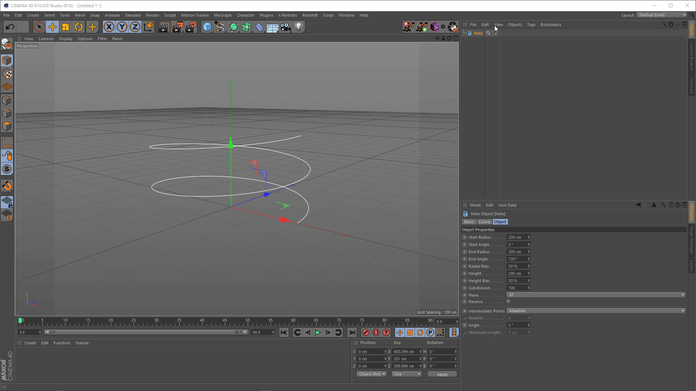

# Copy & Paste Splines between C4D & Houdini:

  
 <b>copy-spline-points-for-houdini-curves-node.py</b> 
Copy the position of Spline Points to your clipboard and easily paste them into Houdini's Curve Node. 

https://twitter.com/lasse_lauch/status/1058057404431110146 

 <b>paste-spline-from-houdini-geometry-spreadsheet.py</b> 
Use "Copy Selection as Text" from Houdini's Geometry Spreadsheet to paste a new Spline into C4D. 
